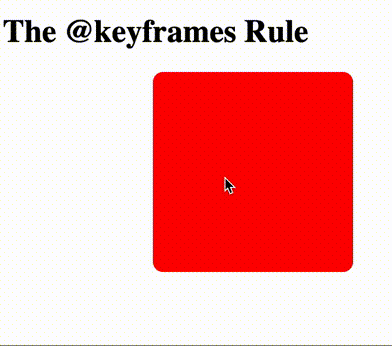
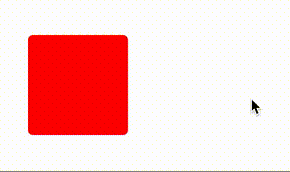

# Animationen mit CSS

Mit CSS-Animationen können die meisten HTML-Elemente ohne JavaScript oder [Flash](https://www.youtube.com/watch?v=oHg5SJYRHA0) animiert werden!

## Animations mit keyframes

Hier eine [Übersicht](https://developer.mozilla.org/en-US/docs/Web/CSS/CSS_animated_properties) vom Mozilla Developer Network welche CSS Parameter zunächst animiert werden können. Lea Verou hat eine [übersichtliche Seite](http://leaverou.github.io/animatable/) gestaltet mit verschiedenen Animationen gestaltet. Sie verändert jeweils nur einen CSS Parameter und animiert zwischen zwei Werten. Sie ist auch die Autorin vom Buch "[CSS Secrets](https://www.amazon.com/CSS-Secrets-Lea-Verou/dp/1449372635?tag=leaverou-20)".

Erstellen wir eine simple Animation:



Hier werden insgesamt drei Parameter animiert. Welche? 
<details>
<summary>Lösung</summary>
<p>

```css
transform: rotate(90deg) scale(2);
left: 200px;
```

</p>
</details> 

Zuerst erstellen wir unsere Animation mit der Regel @keyframes. Diese hat folgende Struktur:

```css
@keyframes <animation-name> {
      keyframe selector {
        css styles here ....
      }
    }
```

Animation-name ist der Name der Animation (in diesem Fall movein).
Wir verwenden zwei Keyframe-Selektoren. Eine, um den Anfang unserer Animation(from) zu definieren und eine für das Ende unserer Animation(to).

```css
@keyframes movein {
      from {
        left: -200px;
        transform: rotate(0deg);
      }
      to {
        left: 200px;
        transform: rotate(90deg) scale(2);
      }
    }
```

Anstatt __from__ und __to__ können wir auch Prozente angeben (from entspricht 0% und to 100% sowie Zwischenschritte: 25%, 50%, 75%, etc.). Beliebig viele CSS Parameter können innerhalb des Keyframe Selektors definiert werden.

Jetzt müssen wir diese Animation auf eines unserer Elemente anwenden. Wir verwenden die Eigenschaften Animationsname und Animationsdauer. 

Das CSS für das rote Quadrat sieht folgendermassen aus:

```css
div.red {
      width: 100px;
      height: 100px;
      background-color: red;
      position: absolute;
      animation: movein 1s ease-in-out;
      top: 150px;
      border-radius: 5px;
    }
```

Für die Animation relevant ist diese Zeile:

```css
animation: movein 1s ease-in-out;
```

Die vollständige Struktur von __animation__ wäre:

```css
animation: <animation-name> <length> <easing> <delay> <iteration> <direction>;
```

  - length: Die Länge der Animation in sec (z. B. 1s)
  - Easing: Linear / Ease / Ease-in / Ease-out / bzw [cubic-bezier](http://cubic-bezier.com)
  - Iteration (optional): wie oft z.B. 2 für 2mal, oder infinite
  - Direction: normal / reverse / alternate / alternate-reverse

Mehr dazu in der [Dokumentation](https://developer.mozilla.org/en-US/docs/Web/CSS/animation).

Oft soll die Animation im Zustand des letzten Keyframes stehen bleiben. Dies ist aber nicht per default der Fall. Der __animation-fill-mode__ muss auf __forwards__ gesetzt werden:

```css
animation-fill-mode: forwards;
```

Die Mozilla [Dokumentation](https://developer.mozilla.org/en-US/docs/Web/CSS/animation-fill-mode) bietet mehr Infos dazu.

Als Alternative kann man den __animation-fill-mode__ auch direkt am Ende der animation Zeile einfügen, wie z. B.:

```css
animation: movein 1s ease-in-out forwards;
```

Das vollständige Beispiel gibt es unter diesem [Link](https://gist.github.com/caocaostudio/9809018c7f181e62fe8ff2f9287d19e5).

## Transitions

CSS Transitions können CSS Parameter über eine bestimmte Dauer stufenlos (von einem Wert zum anderen) ändern. Meist wird das bei __hover__ (mouseover) eingesetzt wie hier zu sehen: 



Um eine Transition zu erzeugen, müssen zwei Dinge angegeben werden:

  - der CSS Parameter, der verändert werden soll.
  - die Dauer der Transition in sec.

Im obigen Beispiel werden zwei CSS Parameter verändert. Welche? 

<details>
<summary>Lösung</summary>
<p>

```css
background-color: green; /* from red */
transform: rotate(45deg); /* from 0deg */
```

</p>
</details> 

Das Element welches animiert werden soll (in diesem Fall das rote div), erhält folgende Zeile:

```css
div.red {
    transition: all 2s;
    width: 100px;
    height: 100px;
    background-color: red;
    position: absolute;
}
```

und bei mouseover:

```css
div.red:hover {
   background: green;
   transform: rotate(45deg);
}
```

Soll verschiedene Parameter mit verschiedenen Zeiten animiert werden, dann muss dies in einer einzigen Zeile geschehen:
```css
transition: background 4s, transform 2s;
```

Die Farbe ändert sich nun über 4sec. wobei die Rotation innerhalb von 2sec. ausgeführt wird.

## Mehrere Animation simultan

Mit dem Komma können für ein Element mehrere Animation definiert werden. Es gilt lediglich zu beachten, dass nicht dieselben Parameter in den einzelnen Animation verändert werden können (sprich transform kann nur in einer Animation vorkommen):

```css
animation: rotate 1s linear infinite, colorchange 3s linear infinite alternate ;
```

Hier werden zwei Animationen (__rotate__ und __colorchange__) für ein Element definiert. Die zweite Animation __colorchange__ kann sogar mit einem Delay (hier z. B. 5sec.) gestartet werden. Achtung, die Reihenfolge ist wichtig:

```css
animation: rotate 1s linear infinite, colorchange 3s linear 5s infinite alternate ;
```

Der ganze Code:

```css
.red {
  width: 100px;
  height: 100px;
  background-color: red;
  animation: rotate 1s linear infinite, colorchange 3s linear infinite alternate ;
      
}
@keyframes rotate {
  to {
    transform: rotate(360deg);
  }
}

@keyframes colorchange {
  to {
    background-color: blue;
  }
}
```

## Weiterführende Links

  - [Animista](http://animista.net/play/)
  - [The Shapes of CSS](https://css-tricks.com/the-shapes-of-css/)
  - [Swiss in CSS](https://swissincss.com)