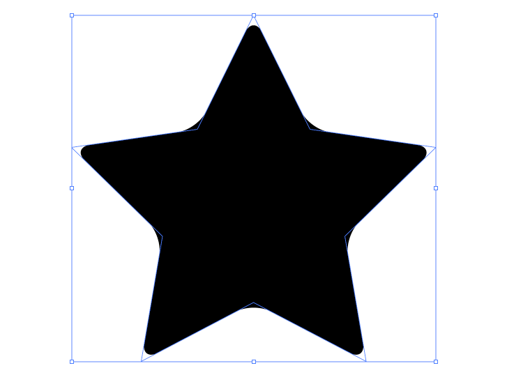
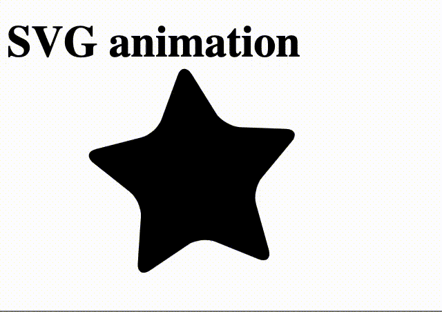
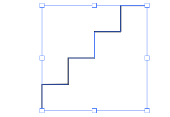

# SVG grafiken animieren

[SVG](https://svgontheweb.com) steht für Scalable Vector Graphics. Es ist ein XML-basiertes Vektorformat für zweidimensionale Grafiken welche animiert und interaktiv fürs Web verwendet können.

Eine (rote) Linie als SVG könnte so aussehen: 

```xml
<svg>
    <line stroke="#ff0000" x1="0.4" y1="78.2" x2="78.2" y2="0.4" />
</svg>
```

Hier eine [Übersicht](https://developer.mozilla.org/en-US/docs/Web/SVG/Tutorial/Basic_Shapes) aller basic shapes von SVG.

Dieser Code kann direkt ins HTML eingefügt werden. Es handelt sich deshalb um eine Inline SVG. Mehr zu den Grundformen vom SVG Format hier unter diesem [Link](https://www.w3schools.com/html/html5_svg.asp).

Illustrator (bzw. [Inkscape](https://inkscape.org/)) arbeiten ebenso mit Vektorgrafiken. Diese können bis zu einer gewissen Komplexität direkt in den HTML Code eingebunden werden.

Hier ein einfacher Stern als Vektorgrafik, welche im Illustrator selektiert wurde:



Und hier dieselbe Vektorgrafik im Browser animiert:



Die Vektorgrafik kann in ein XML Format konvertiert werden, indem sie aus dem Illustrations-Programm kopiert wird und anschliessend in den Text-Editor eingefügt wird (Copy/Paste).

Eine eingefügte Grafik könnte so aussehen:

```xml
<!-- Generator: Adobe Illustrator 22.1.0, SVG Export Plug-In  -->
<svg version="1.1"
	 xmlns="http://www.w3.org/2000/svg" xmlns:xlink="http://www.w3.org/1999/xlink" xmlns:a="http://ns.adobe.com/AdobeSVGViewerExtensions/3.0/"
	 x="0px" y="0px" width="76.8px" height="73.1px" viewBox="0 0 76.8 73.1" style="enable-background:new 0 0 76.8 73.1;"
	 xml:space="preserve">
<defs>
</defs>
<g>
	<path d="M36.5,1.6c1-2.1,2.7-2.1,3.8,0L49,19.3c1,2.1,3.8,4.1,6.1,4.4l19.5,2.8c2.3,0.3,2.8,1.9,1.2,3.6L61.6,43.9
		c-1.7,1.6-2.7,4.9-2.3,7.2l3.3,19.5c0.4,2.3-1,3.3-3,2.2l-17.5-9.2c-2.1-1.1-5.5-1.1-7.5,0l-17.5,9.2c-2.1,1.1-3.4,0.1-3-2.2
		L17.4,51c0.4-2.3-0.7-5.5-2.3-7.2L1,30.1c-1.7-1.6-1.2-3.2,1.2-3.6l19.5-2.8c2.3-0.3,5.1-2.3,6.1-4.4L36.5,1.6z"/>
</g>
</svg>
```

Die erste Zeile ist lediglich ein \<!-- Kommentar  -->. Danach kommt das Element <__svg__> , welches das <__g__> Element beinhaltet. Innerhalb eines <__g__> Elementes können mehrere SVG Elemente zu einer Gruppe zusammengefasst werden.

Das Element <__path__> beschreibt nun die Vektorgrafik mittels x,y Koordinaten und Pfaden. Um es mit CSS zu animieren bzw. zu steuern, kann eine Klasse für dieses Element definiert werden:

```xml
	<path class="star" d="M36.5,1.6c1-2.1,2.7-2.1,3.8,0L49,19.3c1,2.1,3.8,4.1,6.1,4.4l19.5,2.8c2.3,0.3,2.8,1.9,1.2,3.6L61.6,43.9
		c-1.7,1.6-2.7,4.9-2.3,7.2l3.3,19.5c0.4,2.3-1,3.3-3,2.2l-17.5-9.2c-2.1-1.1-5.5-1.1-7.5,0l-17.5,9.2c-2.1,1.1-3.4,0.1-3-2.2
		L17.4,51c0.4-2.3-0.7-5.5-2.3-7.2L1,30.1c-1.7-1.6-1.2-3.2,1.2-3.6l19.5-2.8c2.3-0.3,5.1-2.3,6.1-4.4L36.5,1.6z"/>
```

Im CSS kann die Klasse genauer beschrieben werden (Farbe, Position, Grösse) und die Animation definiert werden (z. B  __stroke__ für die Konturlinie, __fill__ für die Füllfarbe. Hier eine komplette [Übersicht](https://www.w3.org/TR/SVG11/styling.html) aller Parameter für das "styling" von SVG):

```css
.star {
	fill: #ff0000;
	stroke: black;
	animation: rotate 2s infinite;
}

@keyframes rotate {
	from {}
	to {
		transform: rotate(360deg);
	}
}
```

Der Stern rotiert allerdings nicht um die Mitte, sondern der Rotationspunkt liegt an der linken oberen Ecke. Hierfür kann [__transform-origin__](https://developer.mozilla.org/en-US/docs/Web/CSS/transform-origin) hilfreich sein:

```css
transform-origin: center center;
```

Für __transform-origin__ kann entweder nur ein, zwei oder drei Parameter gesetzt werden (e.q. X, Y, Z Achsen).

Es fällt noch auf, dass die Vektorgrafik "geclipped" wird, d. h. sie wird an den Grenzen des SVG Rahmens abgeschnitten. Um dieses Problem zu lösen, hilft der [__overflow__](https://www.w3schools.com/cssref/pr_pos_overflow.asp) Parameter. 

```css
svg {
	overflow: visible;
}
```

Diese Regel wird auf **alle** svg Blockelemente angewandt. Die Art und Weise wie Elemente für die einzelnen CSS Regeln ausgewählt werden, nennt man auch [CSS Selektoren](https://www.w3schools.com/cssref/css_selectors.asp).

### Challenge

Versucht eine eigene Vektorgrafik aus einem Vektorprogramm zu exportieren und mit mind. 2 Parameter zu animieren.

## SVG Linienanimation

SVG Pfade können so animiert werden, dass sie wie gezeichnet wirken. Dazu wird ein Trick aus zwei CSS Parameter für SVG Pfade verwendet (__stroke-dasharray__ und __stroke-dashoffset__). Hier ein Pfad aus dem Vektorprogramm:



Als kopiertes SVG sieht es so aus:

```xml
<svg version="1.1" xmlns="http://www.w3.org/2000/svg" xmlns:xlink="http://www.w3.org/1999/xlink"
        xmlns:a="http://ns.adobe.com/AdobeSVGViewerExtensions/3.0/" x="0px" y="0px" width="96.5px" height="92.5px"
        viewBox="20 20 96.5 92.5" style="enable-background:new 0 0 96.5 92.5;" xml:space="preserve">
        <defs>
        </defs>

        <polyline class="st0"
            points="0.5,108.5 0.5,81.7 27.5,81.5 27.5,54.5 54.5,54.5 54.5,27.5 81.5,27.5 81.5,0.5 108.5,0.5 " />
    </svg>
```

Der Pfad ist als polyline definiert und hat bereits die Klasse _st0__.

Mit __stroke-dasharray__ kann eine gestrichelte Linie erzeugt werden:

```css
.st0 {
	stroke: black;
	stroke-dasharray: 2;
	stroke-width: 1px;
	fill: transparent;
}
```

Probiert jeweils __stroke-width__, __stroke-dasharray__ und __fill__ zu verändern.

Je höher dass __stroke-dasharray__, desto "weniger" sieht man den Pfad. Die gestrichelte Linie kann nun mit __stroke-dashoffset__ animiert werden:

```css
.st0 {
	stroke: black;
	stroke-dasharray: 10;
	stroke-width: 1px;
	fill: transparent;
	animation: strich 1s infinite linear; /* linear damit es beim Loop nicht stockt */
}
 @keyframes strich {
	from {}

	to {
		stroke-dashoffset: 12; /* diesen Wert über trial & error ermittelt, damit die Animation flüssig wirkt
	}
}
```

Hier der komplette [Code](https://gist.github.com/caocaostudio/98e8933e5d3e5ed82b6b39f44a741d62) für dieses Beispiel.

Lässt man die Animation wieder weg, und erhöht das __stroke-dasharray__, dann verschwindet die Linie ab einem gewissen Wert (abhängig von der Pfadlänge). Man muss sich ein wenig hintasten und mit den Werten für __stroke-dasharray__ und __stroke-dashoffset__ herumexperimentieren. Beide sollte gerade nicht mehr sichtbar sein (d.h. der Abstand der gestrichelten Linie ist länger als der Pfad selbst):

```css
.st0 {
	stroke: black;
	stroke-dasharray: 220;
    stroke-dashoffset: 220;
	stroke-width: 1px;
	fill: transparent;
}
```

Nun kann der __stroke-dashoffset__ animiert werden:

```css
.st0 {
	stroke-dasharray: 220;
    stroke-dashoffset: 220;
	animation: offset 2s infinite alternate linear; 
}
 @keyframes offset {
	from {
		stroke-dashoffset: 220;
	}

	to {
		stroke-dashoffset: 0;
	}
}
```

Wichtig ist den __animation-fill-mode__ zu setzen, falls die Animation nicht loopen sollte (ansonsten springt der Pfad wieder in seine Ausgangsposition zurück):

```css
.st0 {
	stroke-dasharray: 220;
	stroke-dashoffset: 220;
	animation: offset 2s infinite alternate linear; 
	animation-fill-mode: forwards;
}
```

Die Pfadlänge kann man auch per Javascript herausfinden. Am besten den Inspector öffnen und die in die Konsole folgendes kopieren:

```js
var path = document.querySelector('.st0');
path.getTotalLength();
```

Die Antwort für den Beispiel Pfad wäre also 216 (anstatt 220).

### Aufgabe

Gestalte verschiedene Vektorpfade, welche mit  __stroke-dashoffset__ und __stroke-dasharray__ bzw. den stroke Parametern animiert werden.

# CSS Variablen

CSS Variablen sind wie Container-Objekte, welche bestimmte Werte enthalten, die in einem Dokument wiederverwendet werden können. In allen Programmiersprachen werden Variablen verwendet, um dynamische Werte zu speichern. In CSS können Variable wie folgt definiert werden:

```css
--deepest-black: black;
```

Variablen müssen immer mit __--__ (zwei Minus-Zeichen) beginnen. Um die Variable im Code wiederzuverwenden:

```css
background-color: var(--deepest-black);
```

Damit die Variable global gültig bzw. verwendbar ist, muss sie entweder im __:root__ oder im __body__ Element definiert werden:

```css
:root {
	--deepest-black: black;
}

h1 {
	color: var(--deepest-black)
}
```

Falls die Variable nicht definiert ist, kann auch ein Default Wert gesetzt werden:

```css
h1 {
	color: var(--deepest-black, #010101);
}
```

Als Variablen Werte können alle gängigen CSS Einheiten verwendet werden:
```css
:root {
	--deepest-black: black;
	--left-margin: 10px;
	--my-center: 50%;
	--big-font: 3em;
	--another-rouge: #ff0001;
	--bgColor: hsl(20, 50%, 60%);
}
```

Mehr [Infos](https://medium.freecodecamp.org/everything-you-need-to-know-about-css-variables-c74d922ea855) zu CSS Variablen und deren Verwendung.

## Weiterführende Links

  - [Animated Line Drawing with interactive part](https://jakearchibald.com/2013/animated-line-drawing-svg/)
  - [CSS Tricks on SVG Line Animation](https://css-tricks.com/svg-line-animation-works/)
  - [Another simple tutorial on medium](https://medium.com/@sterling.meghan/svg-line-animation-for-beginners-51857c88357f)
  - [Vivius Javascript library](https://maxwellito.github.io/vivus/)
  - [Warpjs](https://github.com/benjamminf/warpjs)